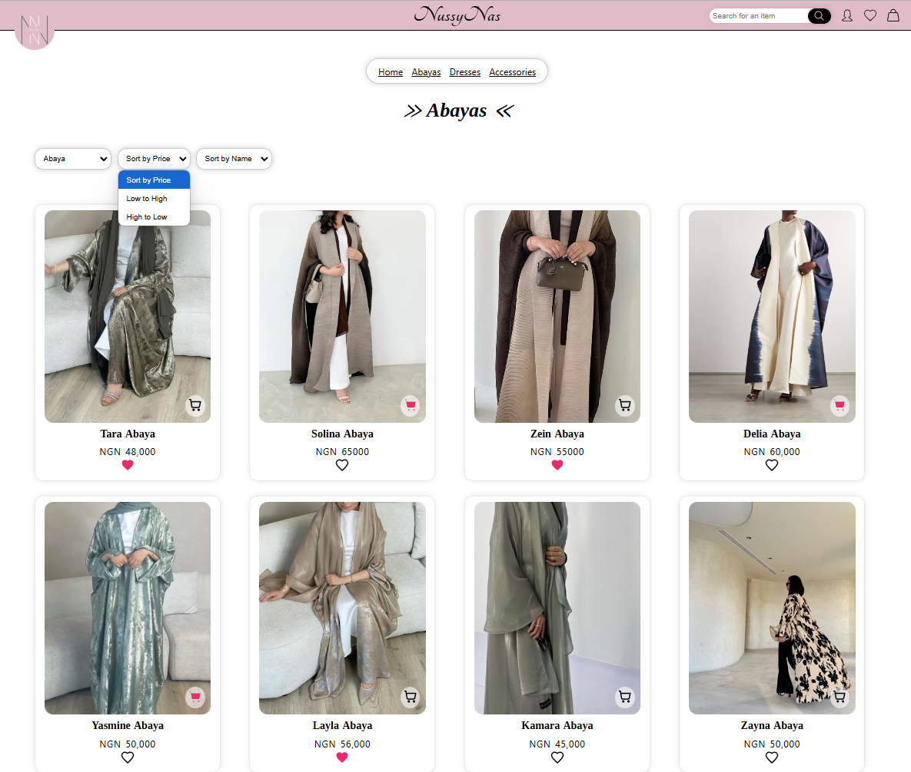
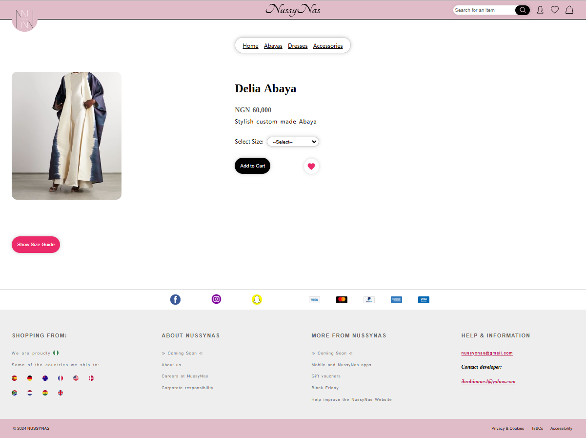
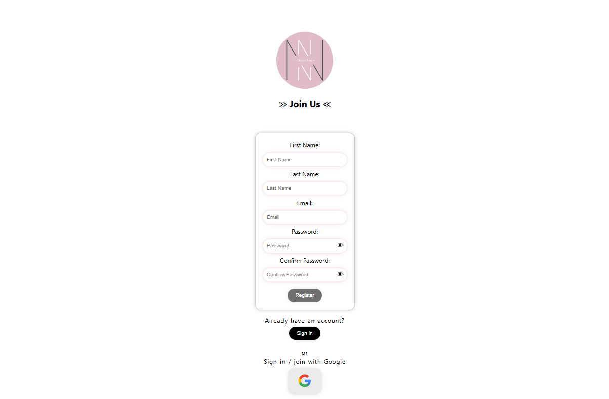
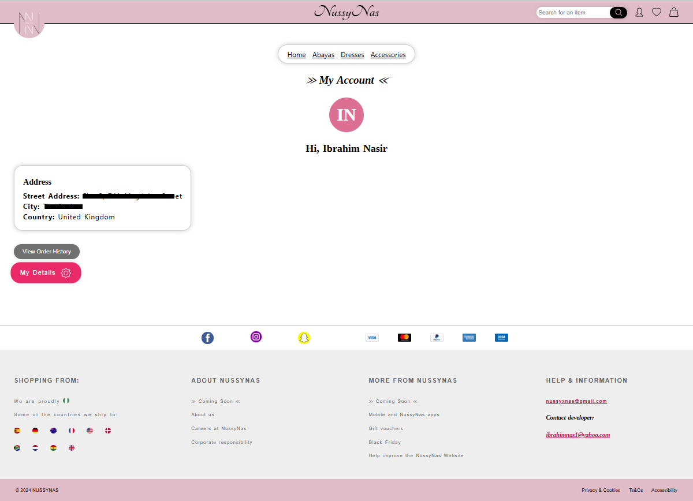
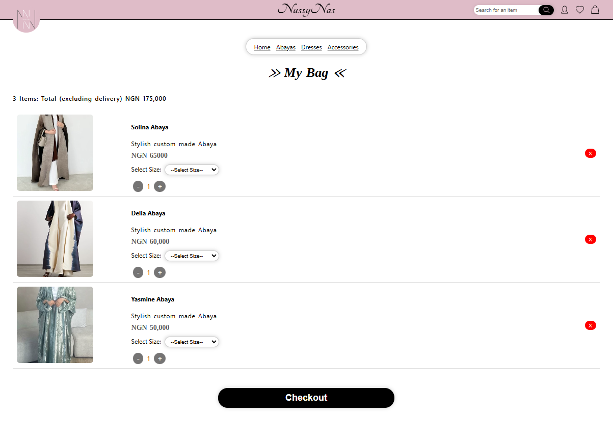
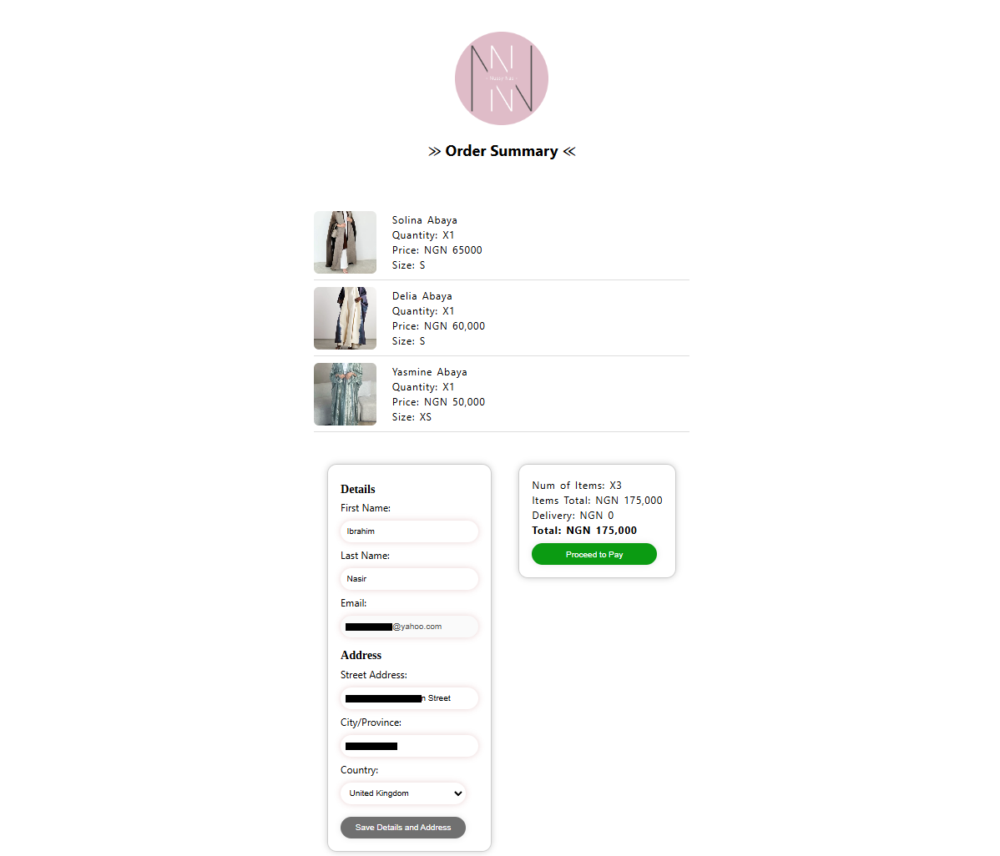
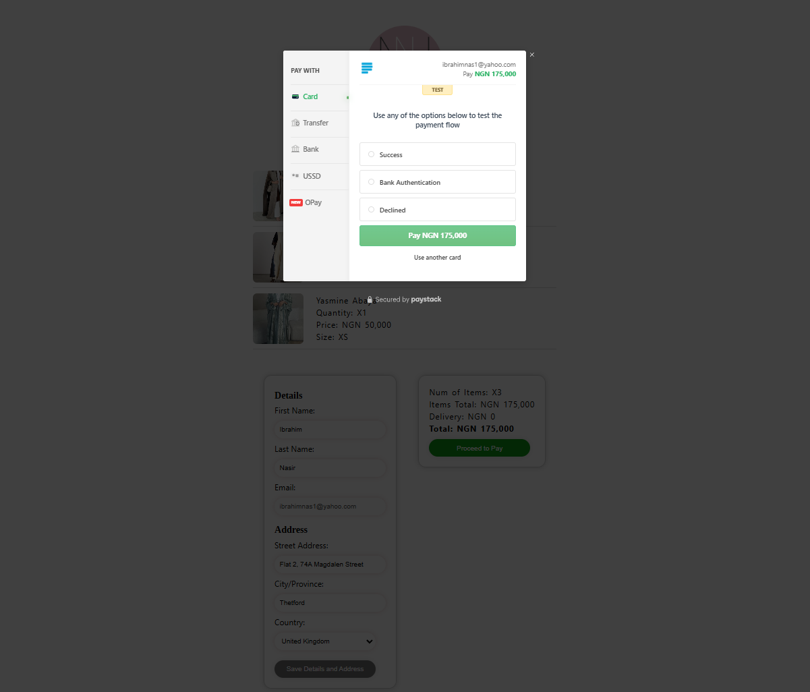

# NussyNas - E-commerce Web App (Demo)

**NussyNas** is an e-commerce web application developed for a client, designed to provide a seamless and secure shopping experience. This demo repository showcases the project’s front-end functionality and core features, excluding sensitive information.


## Table of Contents
- [Overview](#overview)
- [Features](#features)
- [Technologies Used](#technologies-used)
- [Setup](#setup)
- [Usage](#usage)
- [Demo](#demo)
- [Screenshots](#screenshots)
- [Contributing](#contributing)
- [License](#license)

## Overview
NussyNas is a full-featured e-commerce platform built with React, Firebase, and Paystack, designed for an intuitive and secure shopping experience. This project is a demo version showcasing the app’s features while protecting sensitive information, such as API keys.

## Features
- **User Authentication**: 
  Sign up and sign in with email/password or Google. Users can also reset their passwords.

- **User Account**: 
  Manage and edit user information, including address and view order history.

- **Product List and Filtering**: 
  Sort products by category, price, or popularity; includes a responsive product search.

- **Shopping Cart (Bag) and Liked Items**: 
  Add products to a cart or save them to a favorites list.

- **Checkout & Payment**: 
  Integrated with Paystack for secure payment processing.

- **Order Confirmation Email**: 
  An automated email is sent to the business owner and the customer for every successful order.

- **Dynamic Delivery Cost**: 
  Calculated based on product cost and user location.

## Technologies Used

- **Frontend:**
  - React JavaScript
  - CSS modules, HTML

- **Backend:**
  - Firebase (Firestore for data storage, Authentication, and Functions)

- **Payment:**
  - Paystack API integration

- **Other APIs:**
  - Google API for authentication, Gmail API for automated email notifications

- **Hosting:**
  - Netlify

## Setup
1. Clone the repository:
   ```bash
   git clone https://github.com/yourusername/nussynas-demo.git
   cd nussynas-demo

2. Install dependencies:
   ```bash
   npm install

3. Set up environment variables:
   - Create a .env file in the root directory and add your Spotify credentials:

4. Start the development server:
   ```bash
   npm start

### Usage

- Product Filtering: Browse and filter products based on category, price, and other criteria.
- User Authentication: Register or log in to save liked items, add products to the cart, and make purchases.
- Order Process: Add items to the cart, proceed to checkout, and complete a purchase with Paystack.

### Demo
A live demo of the project is available [here](https://nussynas.netlify.app/).

## Screenshots

### Home page


### ProductList


### Product Detail


### Register


### User Account


### Bag (Cart)


### Order Summary


### Checkout and payment integration with Paystack


## Contributing
Feel free to fork this repository and submit pull requests with new features or improvements.


## License
This repository is a demonstration project intended to showcase my work and is based on a private eCommerce web app I developed for a client. Sensitive data and proprietary details have been removed, and this project is not licensed for commercial use.

Disclaimer: This code is for educational and portfolio purposes only. Reproduction, distribution, or use of this code for any commercial purpose is strictly prohibited.
